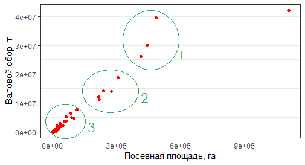
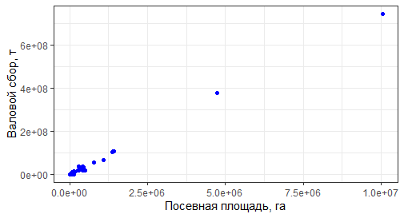
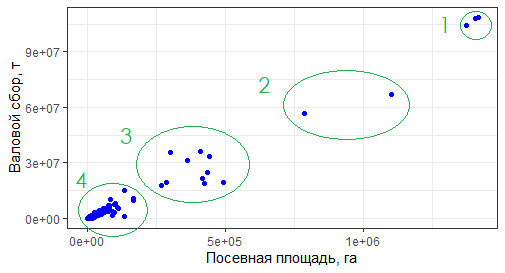

```{r setup, include=FALSE}
knitr::opts_chunk$set(echo = FALSE, comment = "", tidy = T)

library(tidyverse)
library(readxl)

sb <- read_excel("SB.xlsx")
sc <- read_excel("SC.xlsx")

sb_scale <- as.data.frame(sapply(sb[-1], scale))%>% 
  mutate(name = sb$name) %>% 
  na.omit() %>% 
  select(-yeild_tha)

sc_scale <- as.data.frame(sapply(sc[-1], scale)) %>% 
  mutate(name = sc$name) %>% 
  na.omit() %>% 
  select(-yeild_tha)

sc_scale <- sc_scale[!sc_scale$name %in% c("Brazil", "India"),]
sb_scale <- sb_scale[!sb_scale$name %in% c("Russian Federation"),]
```

#### Гипотеза:

Построение кривых Лоренца и расчет индекса Джинни для различных показателей сахароносных культур показало, что их производство сосредоточено в небольшом количестве стран, поэтому нашу совокупность можно разделить, в первую очередь, на два больших кластера - это основные производители и все остальные.

В этой работе мы попытаемся выделить кластеры стран на основе построения диаграмма рассеяния, проведения кластеризации методами к-среднего и иерархической кластеризации. И таких основных показателей как валовой сбор, площадь посевов, урожайность, площадь сельско-хозяйственных земель. Так как каждая величина имеет свои единицы измерения, то все показатели необходимо будет нормировать.

#### Методика:

*Кластеризация (или кластерный анализ)* — это задача разбиения множества объектов на группы, называемые кластерами. Внутри каждой группы должны оказаться «похожие» объекты, а объекты разных группы должны быть как можно более отличны. Главное отличие кластеризации от классификации состоит в том, что перечень групп четко не задан и определяется в процессе работы алгоритма.

Вхождение объектов в ту или иную группу/кластер опредлеяется с помощью вычесления расстояния между ними. Существует большое количество расстояний:

* Евклидово расстояние и его квадрта
* Манхэттенское расстояние (расстояние городских кварталов)
* Расстояние Чебышева
* Степенное расстояние

Чаще всего используется Евклидово расстояние:

$$d_ij = \sqrt{\sum_{k=1}^m (x_{ik} - x_{jk})^2}$$
Или его квадрта:

$$d_ij = \sum_{k=1}^m (x_{ik} - x_{jk})^2$$

Работа 2.1 подразумевает визуальное разделение на кластеры по диаграмме рассеивания и вычисление полученных центроидов класетров. В работе 2.2 используются алгоритмы к-среднего и иерархической кластеризации.

**Алгоритм k-средних (k-meams)** стремится минимизировать суммарное квадратичное отклонение точек кластеров от центров этих кластеров. Идея метода заключается в следующем:

1. Заранее определяем исходное количество кластеров, на которые будут поделеные данные в итоге
2. Случайно выбираются начальные позиции центроидов кластера
3. Для каждого наблюдения определяется к какому центроиду он ближе всего
4. Далее происходит смещение позиций центроидов
5. Снова для каждого наблюдения определяется к какому центроиду он ближе 
6. Если принадлежность некоторых точек сменилось, то алгоритм повторяется, а если нет, то кластреный анализ сошелся

**Иерархическая класетризация** - метод разделения объектов на группы с использованием дендограммы. Наиболее часто используется метод *одиночной связи или ближнего соседа* для нахождения расстояния между единицами совокупности. Верх дендограммы (ствол) соотвествует всем измерениям, а низ (листья) - одно наблюдение - один кластре. Данный метод свободен от априорного предположения о количестве кластеров.

#### Эмпирика:

Проведем для начала визуальное деление нашей совокупности на кластеры. На рисунке 1 изображен диаграмма рассеяния для сахарной свеклы с выделенными кластерами. Всего было выделено 3 кластера стран, наблюдение для РФ является выбросом. В таблице ниже представлены координаты получившихся кластеров.



```{r}
data.frame("Номер кластера" = c(1, 2, 3),
           "Координата X центроида" = c(5.5e+05, 2.8e+05, 0.75e+05),
           "Координата Y центроида" = c(3.01e+07, 1.5e+07, 0.4e+05))
```

В первую группу входят *страны-лидеры* по производству сахарной свеклы, со средней посевной площадью 550 тыс. га и средним валовым сбором 30 млн т. (Франция, США, Германия). Во вторую группу входят *крупные производители* со средней посевной площадью 280 тыс. га и средним валовым сбором 15 млн т. (Турция, Польша, Украина, Китай, Египет). В последний кластер были выделены *остальные страны* с наименьшими показателями производства сахарной свеклы, это Румыния, Венгрия, Литва, Хорватия и др. К странам-лидерам можно отнести Россию, хотя она и сильно отличается от 1 кластера (площадь посевов в 2 раза больше, а валовой сбор на 12 млн т.). 

На рисунке 2 представлена диаграмма рассеяния для сахарного тростника. Видно, что основная часть наблюдений сосредоточена в левом нижнем углу. Наблюдения для Бразилии и Индии являются выбросами. Удалим их из нашего анализа.



На рисунке 3 четко выделяются 4 кластера. В таблице ниже перечислены координатых центроидов для каждого кластера.



```{r}
data.frame("Номер кластера" = c(1, 2, 3, 4),
           "Координата X центроида" = c(1.3e+06, 0.9e+06, 3e+05, 1e+05),
           "Координата Y центроида" = c(10e+07, 6e+07, 2.9e+07, 1e+07))
```

Отдельно выделяются Бразилия и Индия, которые являются *абсолютными лидерами* среди всех стран. В первую группу входят *страны-лидеры* - это Китай, Таиланд, со среденими показателями: 100 млн т - валовой сбор и 1.3 млн га - посевная площадь. Кластер №2 соотвествует двум наблюдениям - это Пакистан и Мексика. Это *крупные-производители*, со средними показателями равными 60 млн т (валовой сбор) и 900 тыс. га (посевная площадь). Третий кластер соотвествует уже более большой группе *стран со средними показателями производства* сахарного тростника. В него входят - Колумбия, Гватемала, Автстралия, США и др. (валовой сбор - 30 млн т, посевная площадь - 300 тыс. га). Четвертый кластер соответсвует *остальным странам* таким, как Оман, Испания, Ирак и т.д.

Для кластерного анализа с помощью R проведем для начала нормирование наших данных:

```{r}
head(sb_scale, 2)
head(sc_scale, 2)
```

Проведем кластерный анализ методом k-means для сахарной свеклы и сахарного тростника

```{r, include=FALSE}
fit <- sb_scale %>% 
  select(1:2) %>% 
  kmeans(3)

sb_scale$clusters <- factor(fit$cluster)

fit2 <- sc_scale %>% 
  select(1:2) %>% 
  kmeans(4)

sc_scale$clusters <- factor(fit2$cluster)
```

На рисунке 4 визуализировано деление на кластеры. Результат выполнения алгоритма для сахарной свеклы идентичен визуальному способу разбивки. Что касается сахарного тростника, то существуют небольшие расхождения, так как оптимальное число кластеров варьируется от 3-4 шт. В обоих случаях из выборки убраны выборосы (РФ, Бразилия и Индия)

```{r, fig.show="hold", out.width="50%", fig.cap= "Рис. 4 результат кластеризации методом k-means"}
ggplot(sb_scale, aes(`area harvested_ha`, `production quantity_t`, col = clusters))+
  geom_point(size = 3)+
  ggtitle("Сахарная свекла")+
  xlab("Посевная площадь") +
  ylab("Валовой сбор, т") +
  theme_bw() +
  theme(plot.title = element_text(hjust = 0.5))

ggplot(sc_scale, aes(`area harvested_ha`, `production quantity_t`, col = clusters))+
  geom_point(size = 3)+
  ggtitle("Сахарный тростник")+
  xlab("Посевная площадь") +
  ylab("Валовой сбор") +
  theme_bw()+
  theme(plot.title = element_text(hjust = 0.5))
```

Выполним кластерный анализ методом иерархической кластеризации

```{r, include=FALSE}
d <-  dist(sb_scale[-5])
res <- hclust(d, method = "single")

d1 <-  dist(sc_scale[-5])
res1 <- hclust(d1, method = "single")
```

Рисунок 5 отображает дендограммы, которые были построены в результате исполнения алгоритма иерархической кластеризации. В кластеризации участвовали такие показатели, как валовой сбор, площадь посевово и общая площдь с/х земель. В случае сахарной свеклы из набора данных была удалена Россия, которая мешала адекватному разбиению на кластеры. Можно заметить, что разделение объектов на кластеры имеет одну закономерность: что у сахарной свеклы, что у сахарного тростника выделяются страны-лидеры, основной массив стран и страны с наименьшими показателямми.

```{r, fig.show="hold", out.width="50%", fig.cap= "Рис. 5 результат иерархической кластеризации"}
plot(res, 
     main = "Сахарная свекла",
     xlab = "")
rect.hclust(res, 5)

plot(res1, 
     main = "Сахарный тростник",
     xlab = "")
rect.hclust(res1, 4)
```

#### Результат:

В результате проведения кластерного анализа для стран, которые занимаются производством основных сахароносных культур: сахарная свекла и сахарный тростник были получены следующие выводы. Во-первых, у каждой сахароносной культуры есть страна или группы стран, которые значительно выделяются по показателям (по сахарной свекле - это РФ, по сахарному тростнику - это Бразилия и Индия). Во-вторых, результат эмпирических вычислений подтверждает гипотезу о концетраци рынка (страны-лидеры для сахарной свеклы - РФ, США, Китай, Германия, Фрацния; для сахарного тростника - Бразилия, Индия, Китай, Таиланд, Пакистан), то есть каждый из методов группировки выделил группу стран с наибольшими покателями (страны-лидеры), небольшое количество купных производителей и значительную часть остальных стран.

#### Верификация:

Оптимальное количество кластеров можно получить на основу такого показателя, как *общая внутригрупповая сумма квадратов*. Если добавление одного кластера в наши данные значительно понижает общую сумму квадратов, то в увеличении числа кластеров есть смысл. Если при увеличении числа кластеров идет плавное снижение общей внутригрупповой суммы квадратов, то количество кластеров избыточно. На рисунке 6 видно, что оптимальное число выделяемых кластеров составляет 3-4.

```{r, include=FALSE}
f1<- sb_scale %>% 
  select(1:2) %>% 
  kmeans(1)
f2<- sb_scale %>% 
  select(1:2) %>% 
  kmeans(2)
f3<- sb_scale %>% 
  select(1:2) %>% 
  kmeans(3)
f4<- sb_scale %>% 
  select(1:2) %>% 
  kmeans(4)
f5<- sb_scale %>% 
  select(1:2) %>% 
  kmeans(5)
f6<- sb_scale %>% 
  select(1:2) %>% 
  kmeans(6)

tt <- data.frame(tt_w = c(f1$tot.withinss, f2$tot.withinss, f3$tot.withinss, 
                        f4$tot.withinss, f5$tot.withinss, f6$tot.withinss),
                 clasters = c(1:6))
```
```{r, include=FALSE}
f_1<- sc_scale %>% 
  select(1:2) %>% 
  kmeans(1)
f_2<- sc_scale %>% 
  select(1:2) %>% 
  kmeans(2)
f_3<- sc_scale %>% 
  select(1:2) %>% 
  kmeans(3)
f_4<- sc_scale %>% 
  select(1:2) %>% 
  kmeans(4)
f_5<- sc_scale %>% 
  select(1:2) %>% 
  kmeans(5)
f_6<- sc_scale %>% 
  select(1:2) %>% 
  kmeans(6)

t_t <- data.frame(tt_w = c(f_1$tot.withinss, f_2$tot.withinss, f_3$tot.withinss, 
                        f_4$tot.withinss, f_5$tot.withinss, f_6$tot.withinss),
                 clasters = c(1:6))
```

```{r, fig.show="hold", out.width="50%", fig.cap= "Рис. 6 оптимальное число кластеров"}
ggplot(tt, aes(x = clasters, y = tt_w))+
  geom_point()+
  geom_line()+
  geom_vline(xintercept = 3.2, col = "red")+
  scale_x_continuous(breaks = 1:6,
                     labels = as.character(tt$clasters))+
  ggtitle("Сахарная свекла")+
  xlab("Количество кластеров")+
  ylab("Общая внутригрупповая сумма квадратов")+
  theme_bw()+
  theme(plot.title = element_text(hjust = 0.5))

ggplot(t_t, aes(x = clasters, y = tt_w))+
  geom_point()+
  geom_line()+
  geom_vline(xintercept = 3.2, col = "red")+
  scale_x_continuous(breaks = 1:6,
                     labels = as.character(t_t$clasters))+
  ggtitle("Сахарный тростник")+
  xlab("Количество кластеров")+
  ylab("Общая внутригрупповая сумма квадратов")+
  theme_bw()+
  theme(plot.title = element_text(hjust = 0.5))
```

Таким образом нам удалось провести кластерный анализ двумя способами и подтвердить нашу гипотезу.